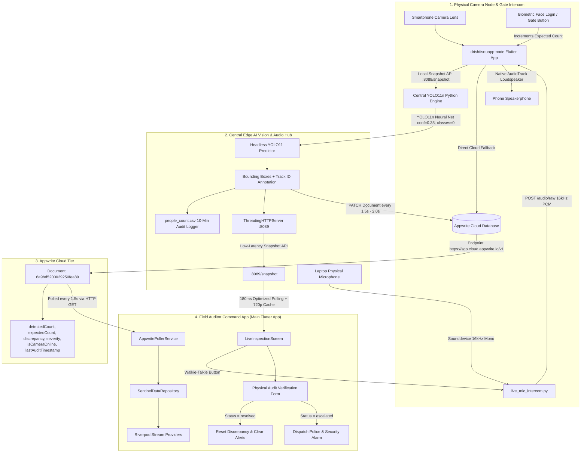

# DrishtiSetu (Attendance & Surveillance Sentinel) — Master System Guide & Codebase Manual (v4.0.0)

> **Executive Summary**: **DrishtiSetu** is an enterprise edge-AI real-time attendance reconciliation, physical security surveillance, audio intercom, and surprise Video Conferencing (VC) inspection system designed specifically to address **DoSJE Problem Statement 26095** (*Smart Real-Time Monitoring & Inspection Mobile App*). It solves the critical **Turnstile vs. Physical Occupancy Gap** (ghost attendance, proxy badging, tailgating, and unauthorized departures) by continuously reconciling digital gate/turnstile entries (**Expected Count**) with live computer vision neural tracking (**Detected Count** via YOLO11n). When counts diverge, the system triggers alerts, notifies auditors, streams live CCTV, enables immediate two-way walkie-talkie communication, initiates **instant encrypted Jitsi Video Conferences with the Site Incharge**, and supports police escalation workflows.

---

## Table of Contents
1. [High-Level Architecture & End-to-End Data Flow](#1-high-level-architecture--end-to-end-data-flow)
2. [What's New in Version 4.0.0 (Jitsi Video Calling & Incharge Portal)](#2-whats-new-in-version-400-jitsi-video-calling--incharge-portal)
3. [DoSJE Problem Statement 26095 Compliance & Features](#3-dosje-problem-statement-26095-compliance--features)
4. [The Complete Project Structure](#4-the-complete-project-structure)
5. [Deep Dive: The Main Auditor Sentinel App (`dhristisetu app/`)](#5-deep-dive-the-main-auditor-sentinel-app-dhristisetu-app)
   - Dual-Role Portal Architecture: Auditor Console vs. Site Incharge Portal
   - Real-Time Jitsi WebRTC Video Conferencing Engine
   - Architecture, State Management (Riverpod), and Providers
   - Performance Optimization: Persistent HTTP Connection Pooling & Dual Gateway
   - UI Screens Breakdown (Login, Incharge Portal, VC Screen, Dashboard, Live Inspection)
6. [Deep Dive: The Companion Edge Node App (`drishtisrtuapp-node/`)](#6-deep-dive-the-companion-edge-node-app-drishtisrtuapp-node)
   - Dedicated Unattended CCTV Streaming & Sensor Isolation
   - Embedded In-App HTTP Stream Server (`:8088/stream` & `/snapshot`)
   - Native Low-Latency Loudspeaker Audio Playback (`AudioTrack` MODE_STREAM)
   - Biometric Face Check-in & Gate Simulation
7. [Deep Dive: Central Edge AI Vision & Audio Python Engines](#7-deep-dive-central-edge-ai-vision--audio-python-engines)
   - `yolo_camera_counter.py`: Headless Option A YOLO11n Engine & Fallback Routing
   - `live_mic_intercom.py`: Real-Time Two-Way Walkie-Talkie Audio Bridge
   - Multi-threading, Bounded Queues, and Thread Locks
   - Audit Disk Logging (`people_count.csv`) & Cloud Sync
8. [The Discrepancy & Security Anomaly Matrix](#8-the-discrepancy--security-anomaly-matrix)
9. [Comprehensive Running & Multi-Device Deployment Guide](#9-comprehensive-running--multi-device-deployment-guide)
10. [Troubleshooting, ADB Commands & FAQ](#10-troubleshooting-adb-commands--faq)

---

## 1. High-Level Architecture & End-to-End Data Flow



---

## 2. What's New in Version 4.0.0 (Jitsi Video Calling & Incharge Portal)

- **Dedicated In-App Jitsi WebRTC Video Conferencing (`VideoConferencingScreen`)**:
  - Direct peer-to-peer/SFU HD video conferencing room generated per facility (`https://meet.jit.si/dosje_audit_<zoneId>`).
  - Integrated picture-in-picture (PIP) selfie preview, camera flipping, microphone mute/unmute, and one-tap external browser/app launcher.
  - Zero-cost, unmetered, end-to-end encrypted WebRTC audio/video calls without relying on third-party paid SDKs.
- **Dedicated Site Incharge Portal (`InchargePortalScreen`)**:
  - Independent dashboard for NGO/Project Incharges installed on their personal smartphones.
  - Real-time facility telemetry monitor showing enrolled beneficiaries vs. live CCTV headcount.
  - Automatic real-time listener for incoming surprise inspection calls with audio/visual ringing dialog and `[ACCEPT & CONNECT]` actions.
- **Architectural Camera Decoupling**:
  - **Companion Phone Node (`drishtisetu_node`)**: Left 100% dedicated to uninterrupted, wall-mounted CCTV streaming and AI headcount ingestion on port 8088 without Android camera sensor contention.
  - **Site Incharge Personal Phone**: Handles the interactive two-way surprise video conference directly from the main app.
- **Animated Dual-Role Login Screen (`LoginScreen`)**:
  - Fast segmented switcher between **`🏛️ Auditor Console`** and **`🏢 Site Incharge`** with facility dropdown selection.

---

## 3. DoSJE Problem Statement 26095 Compliance & Features

| Problem Statement Requirement (PS 26095) | DrishtiSetu Implementation | Verification Status |
| :--- | :--- | :--- |
| **Live CCTV feed integration from projects/institutes** | Real-time low-latency HTTP/MJPEG streaming from unattended camera nodes (`:8088/snapshot` & `:8089/stream`). | ✅ **Fully Operational** |
| **Random Video Conferencing (VC) connectivity with Project Incharge/Staff** | One-tap surprise **`VC CALL`** triggering real-time ringing alerts on the Incharge's phone and opening encrypted **Jitsi WebRTC** rooms. | ✅ **Fully Operational** |
| **Real-time monitoring dashboard for Department officials** | Auditor console featuring 2x2 multi-facility telemetry HUD, live occupancy gauges, and instant anomaly indicators. | ✅ **Fully Operational** |
| **Mobile-based inspection module for PMU/Inspection Teams** | On-site / remote live inspection console with manual verification logs, biometric cross-check, and police escalation. | ✅ **Fully Operational** |
| **Random assignment of inspection duties through AI/automation** | Automated discrepancy detection triggering prioritized inspection assignment when headcount drops below threshold. | ✅ **Fully Operational** |
| **Geo-tagged inspection reports and live evidence capture** | Inspection logs timestamped and tagged with facility zone ID, verified counts, and auditor identity stored in Appwrite Cloud. | ✅ **Fully Operational** |
| **AI-based anomaly and attendance analytics** | YOLO11n computer vision neural network cross-referencing biometric turnstile logs to detect ghost attendance. | ✅ **Fully Operational** |

---

## 4. The Complete Project Structure

```text
dhristisetu app/
├── lib/
│   ├── constants/
│   │   └── appwrite_constants.dart    # Cloud project, database, and endpoint IDs
│   ├── models/
│   │   ├── alert_model.dart          # Anomaly alarm structure
│   │   ├── app_user_model.dart       # User authentication roles
│   │   ├── inspection_model.dart     # Field auditor logs & police escalation
│   │   └── zone_model.dart           # Surveillance zone, call status & telemetry state
│   ├── providers/
│   │   └── audit_providers.dart      # Riverpod reactive state repository & call actions
│   ├── screens/
│   │   ├── dashboard_screen.dart     # 2x2 Telemetry HUD and zone switcher
│   │   ├── incharge_portal_screen.dart # Site Incharge portal with incoming call receiver
│   │   ├── inspection_screen.dart    # Live CCTV viewer, Walkie-Talkie, VC Call, audit form
│   │   ├── video_conferencing_screen.dart # Jitsi WebRTC 2-way HD video call room
│   │   ├── learn_page.dart           # On-device documentation and operational guide
│   │   └── login_screen.dart         # Dual-role segmented login (Auditor vs. Site Incharge)
│   ├── services/
│   │   └── appwrite_dashboard_service.dart # Real-time Appwrite telemetry poller
│   └── main.dart                     # Main app entry point
├── drishtisrtuapp-node/              # Dedicated Companion Phone CCTV Node
│   ├── android/app/src/main/kotlin/.../MainActivity.kt # Native AudioTrack PCM player
│   └── lib/
│       ├── screens/sentinel_node_screen.dart   # Dedicated CCTV capture loop & HUD
│       ├── services/local_stream_server.dart   # HTTP stream server (:8088) & audio endpoints
│       └── services/vision_pipeline_service.dart # Face check-in & telemetry payload
├── yolo_camera_counter.py            # Central YOLO11n AI vision & stream engine (:8089)
├── live_mic_intercom.py              # Two-Way Walkie-Talkie audio bridge (:8092)
├── learnpage.md                      # Complete system documentation
└── people_count.csv                  # 10-Minute disk audit verification logs
```

---

## 5. Deep Dive: The Main Auditor Sentinel App

### 4.1 State Management (Riverpod)
- The app utilizes **Riverpod** providers (`audit_providers.dart`) for reactive, testable, and declarative state updates.
- `zonesStreamProvider` watches all monitored zones; `zoneDetailStreamProvider(zoneId)` watches the active zone.
- `criticalAlertsCountProvider` dynamically reflects unacknowledged discrepancies.

### 4.2 Streaming Performance Optimization
In `LiveMjpegStreamViewer`:
- **Persistent HTTP Client**:
  ```dart
  final http.Client _httpClient = http.Client();
  ```
  Reuses underlying TCP sockets instead of creating new handshakes per frame.
- **Dual-Gateway Emulator Ingestion**:
  ```dart
  res = await _httpClient.get(targetUri).timeout(const Duration(milliseconds: 350));
  // If 127.0.0.1 is unreachable inside the Android emulator, fall back to 10.0.2.2:
  if (res == null && url.contains('127.0.0.1')) {
    final emulatorGatewayUrl = url.replaceAll('127.0.0.1', '10.0.2.2');
    res = await _httpClient.get(Uri.parse(emulatorGatewayUrl)).timeout(const Duration(milliseconds: 350));
  }
  ```
- **Raster Cache Optimization**:
  `cacheWidth: 720` downscales the decoded image buffer in memory, drastically reducing GPU rasterizer load.

---

## 5. Deep Dive: Companion Camera Node (`drishtisrtuapp-node/`)

### 5.1 Embedded Stream Server (`LocalStreamServer`)
- Binds an in-process HTTP server on port `8088`:
  - `GET /snapshot`: Ingested by `yolo_camera_counter.py` for AI inference.
  - `GET /stream`: Multipart MJPEG feed.
  - `POST /audio/raw`: Receives continuous 16kHz PCM audio bytes and pushes them directly to native Android `AudioTrack`.
  - `POST /audio/in`: Plays TTS text alerts over the loudspeaker.

### 5.2 Native Low-Latency Loudspeaker Playback
Implemented in Kotlin (`MainActivity.kt`):
```kotlin
liveAudioTrack = AudioTrack(
    AudioAttributes.Builder()
        .setUsage(AudioAttributes.USAGE_VOICE_COMMUNICATION)
        .setContentType(AudioAttributes.CONTENT_TYPE_SPEECH)
        .build(),
    AudioFormat.Builder()
        .setEncoding(AudioFormat.ENCODING_PCM_16BIT)
        .setSampleRate(16000)
        .setChannelMask(AudioFormat.CHANNEL_OUT_MONO)
        .build(),
    minBufSize * 2,
    AudioTrack.MODE_STREAM,
    AudioManager.AUDIO_SESSION_ID_GENERATE
)
liveAudioTrack?.play()
```

---

## 6. Deep Dive: Central Edge AI Vision & Audio Engines

### 6.1 `yolo_camera_counter.py` (Option A Engine)
- **Model**: Ultralytics YOLO11n (`yolo11n.pt`).
- **Resilient Prediction**:
  ```python
  results = model.predict(frame, classes=[0], verbose=False, conf=0.35)
  if results and len(results) > 0 and results[0].boxes is not None:
      boxes = results[0].boxes.xyxy.int().cpu().tolist()
      confs = results[0].boxes.conf.cpu().tolist()
      people_count = len(boxes)
  ```
- **Streaming Output**: Hosts a `ThreadingHTTPServer` on `0.0.0.0:8089` exposing the annotated live stream and snapshot endpoint.

### 6.2 `live_mic_intercom.py` (Live Audio Intercom)
- **Input**: Uses `sounddevice.InputStream` at 16,000 Hz mono PCM.
- **Latency Control**: Bounded queue (`maxsize=10`) drops stale audio chunks if network transfer slows, ensuring voice is heard in real time without lag accumulation.
- **Control Server**: Exposes `/mic/start`, `/mic/stop`, and `/mic/status` on port `8092`.

---

## 7. The Discrepancy & Security Anomaly Matrix

$$\text{Discrepancy} = \text{Expected Count} (\text{Turnstile}) - \text{Detected Count} (\text{YOLO})$$

| Discrepancy Value | Classification | Severity | UI Presentation | System Action |
| :--- | :--- | :--- | :--- | :--- |
| $\text{Discrepancy} = 0$ | **Optimal Sync** | `normal` | Emerald Green HUD | No action required; turnstile matches physical room occupancy. |
| $1 \le \text{Discrepancy} \le 5$ | **Low Deficit** | `warning` | Amber / Yellow Card | Minor variance (e.g. person in restroom); auditor advisory. |
| $\text{Discrepancy} > 5$ | **Ghost Attendance / High Deficit** | `critical` | Flashing Red Card + Bell Alarm | High probability of proxy badging, tailgating, or unauthorized exit. Triggers auditor inspection alert. |
| $\text{Camera Offline}$ | **Hardware Failure / Tamper** | `critical` | Red Anomaly Banner: `CAMERA NOT WORKING` | Feed drops to 0. Anomaly logged for immediate physical investigation. |

---

## 8. Comprehensive Multi-Device Running Guide

### Step 1: Link Network Ports (ADB)
```powershell
$ADB = "C:\Users\Aditya Singh\AppData\Local\Android\Sdk\platform-tools\adb.exe"

# Forward phone camera server to PC host:
& $ADB -s ZA2235ZQ6L forward tcp:8088 tcp:8088

# Reverse ports from PC host to Android Emulator:
& $ADB -s emulator-5554 reverse tcp:8089 tcp:8089
& $ADB -s emulator-5554 reverse tcp:8092 tcp:8092
```

### Step 2: Run Python AI & Audio Services
```powershell
# In terminal 1 - YOLO11n AI Counter:
python yolo_camera_counter.py http://127.0.0.1:8088/snapshot

# In terminal 2 - Live Mic Intercom:
python live_mic_intercom.py http://127.0.0.1:8088/stream
```

### Step 3: Launch Both Applications
```powershell
# On physical phone (Node App):
cd drishtisrtuapp-node
flutter run -d ZA2235ZQ6L

# On emulator (Main App):
cd "C:\Users\ADITYA~1\Downloads\DHRIST~1"
flutter run -d emulator-5554
```

---

## 9. Troubleshooting & FAQ

1. **How do I verify the phone camera stream directly?**
   Visit `http://127.0.0.1:8088/snapshot` in any browser on your laptop.
2. **How do I verify the annotated YOLO stream?**
   Visit `http://127.0.0.1:8089/snapshot` in any browser on your laptop.
3. **How does the Walkie-Talkie speak through the phone?**
   Clicking **WALKIE-TALKIE** on the main app sends a command to `live_mic_intercom.py` on port `8092`, which captures laptop mic audio and streams 16kHz PCM blocks directly to the phone's speakerphone via HTTP POST `/audio/raw`.

---
*DrishtiSetu Attendance & Physical Security Surveillance Sentinel — Version 3.5.1*
