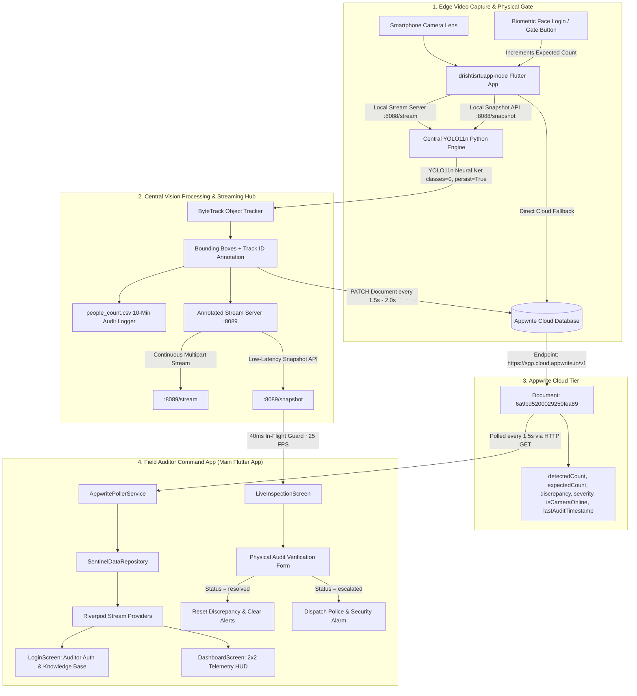

# DrishtiSetu (Attendance & Surveillance Sentinel) — Master System Guide & Codebase Manual

> **Executive Summary**: **DrishtiSetu** is an edge-AI real-time attendance reconciliation and physical security surveillance system. It solves the critical **Turnstile vs. Physical Occupancy Gap** (ghost attendance, proxy badging, tailgating, and unauthorized departures) by continuously reconciling digital gate/turnstile entries (**Expected Count**) with live computer vision neural tracking (**Detected Count** via YOLO11n). When counts diverge, the system triggers alerts, alerts auditors, streams live video, and enables immediate on-site verification and police escalation workflows.

---

## Table of Contents
1. [High-Level Architecture & End-to-End Data Flow](#1-high-level-architecture--end-to-end-data-flow)
2. [Why Did the IDE Show "Devices Not Showing" & How It Works](#2-why-did-the-ide-show-devices-not-showing--how-it-works)
3. [The Complete Project Structure](#3-the-complete-project-structure)
4. [Deep Dive: The Main Auditor Sentinel App (`dhristisetu app/`)](#4-deep-dive-the-main-auditor-sentinel-app-dhristisetu-app)
   - Architecture, State Management (Riverpod), and Providers
   - Models and Data Contracts
   - Services & Appwrite Polling Engine
   - UI Screens Breakdown (Login, Dashboard, Live Inspection, Learn Page)
5. [Deep Dive: The Companion Edge Node App (`drishtisrtuapp-node/`)](#5-deep-dive-the-companion-edge-node-app-drishtisrtuapp-node)
   - Smartphone Camera Ingestion & Lens Selection
   - Embedded In-App HTTP Stream Server (`:8088/stream` & `/snapshot`)
   - Bounding Box Custom Painter & HUD
   - Biometric Face Check-in & Gate Simulation
   - Appwrite Cloud Direct Synchronization
6. [Deep Dive: Central Edge AI Vision Python Engines](#6-deep-dive-central-edge-ai-vision-python-engines)
   - `yolo_camera_counter.py` vs `edge_backend.py`
   - Multi-threading, Thread Locks, and MJPEG Protocol
   - YOLO11n Object Tracking (COCO Class 0 & ByteTrack)
   - Audit Disk Logging (`people_count.csv`) & Cloud Sync
7. [The Discrepancy & Security Anomaly Matrix](#7-the-discrepancy--security-anomaly-matrix)
8. [Comprehensive Running & Multi-Device Deployment Guide](#8-comprehensive-running--multi-device-deployment-guide)
9. [Troubleshooting, ADB Commands & FAQ](#9-troubleshooting-adb-commands--faq)

---

## 1. High-Level Architecture & End-to-End Data Flow



### Data Lifecycle:
1. **Gate Ingestion**: People badge in at an entrance turnstile or perform biometric facial check-in on the **Node App** mounted at the gate. This sets the **Expected Count**.
2. **Visual Detection**: The phone camera streams video frames to the **Central YOLO11n Engine** over local HTTP (`http://<phone-ip>:8088/snapshot`).
3. **AI Inference**: The YOLO11n model detects persons, tracks individuals with persistent IDs, and calculates the **Detected Count**.
4. **Cloud Telemetry**: The backend patches the live counts, camera status, timestamp, and severity to **Appwrite Cloud**.
5. **Auditor Visualization**: The **Main App** polls Appwrite every 1.5s, updating the HUD cards, sounding alarms if discrepancy occurs, and streaming live annotated camera footage.

---

## 2. Why Did the IDE Show "Devices Not Showing" & How It Works

### The Scenario:
In your IDE (VS Code / Antigravity), when you clicked the device selector at the bottom right status bar, the popup showed:
- `Enable web for this project`
- `Enable windows for this project`
- `Enable android for this project`
- *No physical phone or emulator was listed.*

### Why Did This Happen?
1. **Flutter Extension Daemon Idle / Cache**: The IDE's Flutter extension runs a background daemon process (`flutter daemon`). If the project was freshly cloned or opened without Android build folders indexed, or if the daemon was busy/cached, the IDE UI temporarily shows project enablement options rather than querying ADB.
2. **Subdirectory Context**: If the editor focus was inside a subfolder (like `drishtisrtuapp-node/` or a Python script), the IDE device picker context shifted.
3. **The Ground Truth (CLI & ADB)**:
   When running `flutter devices` or `adb devices` in the terminal, **all devices were online, fully authorized, and ready**:
   ```
   Found 4 connected devices:
     moto g86 power 5G (mobile) • ZA2235ZQ6L • android-arm64  • Android 16 (API 36)
     Windows (desktop)          • windows    • windows-x64    • Microsoft Windows
     Chrome (web)               • chrome     • web-javascript • Google Chrome
     Edge (web)                 • edge       • web-javascript • Microsoft Edge
   ```
   And the Android Emulator is available as:
   ```
   Resizable_Experimental • Resizable (Experimental) • Generic • android
   ```

### How to Select or Run Any Device Directly:
- **Run Main App on Emulator**:
  ```powershell
  flutter run -d emulator-5554
  # or launch emulator first if stopped:
  flutter emulators --launch Resizable_Experimental
  flutter run -d Resizable_Experimental
  ```
- **Run Node App on Physical Phone**:
  ```powershell
  cd drishtisrtuapp-node
  flutter run -d ZA2235ZQ6L
  ```
- **In IDE**: Press `Ctrl+Shift+P` -> Type `Flutter: Select Device` -> Click your phone (`moto g86 power 5G`) or emulator.

---

## 3. The Complete Project Structure

```
dhristisetu app/
├── pubspec.yaml                           # Main app dependencies (Riverpod, fl_chart, intl, http)
├── yolo11n.pt                             # Ultralytics YOLO11 Nano neural network weights (5.6 MB)
├── yolo_camera_counter.py                 # Central edge Python AI engine & MJPEG server (:8089)
├── people_count.csv                       # Persistent disk audit log with timestamps & counts
├── learnpage.md                           # This complete documentation manual
│
├── lib/                                   # MAIN AUDITOR FLUTTER APPLICATION
│   ├── main.dart                          # App entry, ProviderScope, dark cyber security theme
│   ├── constants/
│   │   └── appwrite_constants.dart        # Project, database, collection & document keys
│   ├── models/
│   │   ├── alert_model.dart               # Security alert representation (missing person, camera offline)
│   │   ├── app_user_model.dart            # Auditor profile & role credentials
│   │   ├── inspection_model.dart          # Verified physical audit log entry
│   │   └── zone_model.dart                # Complete room telemetry status model
│   ├── providers/
│   │   └── audit_providers.dart           # Riverpod state notifiers, data repository & reactive streams
│   ├── services/
│   │   └── appwrite_dashboard_service.dart# Appwrite REST poller service (1.5s interval)
│   └── screens/
│       ├── login_screen.dart              # Secure authentication & link to knowledge base
│       ├── dashboard_screen.dart          # 2x2 Telemetry HUD, alert bottom sheet & multi-zone drawer
│       ├── inspection_screen.dart         # Landscape/Portrait live camera viewer & audit form
│       └── learn_page.dart                # In-app interactive knowledge base viewer
│
└── drishtisrtuapp-node/                   # COMPANION EDGE SENSOR NODE (SMARTPHONE / IOT)
    ├── edge_backend.py                    # Standalone Edge Python engine with :8088 server
    ├── pubspec.yaml                       # Node dependencies (camera, http, permissions)
    └── lib/
        ├── main.dart                      # Camera discovery, orientation locking & bootstrap
        ├── constants/
        │   └── appwrite_constants.dart    # Cloud sync credentials matching main app
        ├── models/
        │   └── detection_models.dart      # BoundingBox, AttendanceRecord & TelemetryPayload
        ├── screens/
        │   └── sentinel_node_screen.dart  # Mobile camera viewfinder, live stream HUD & gate controls
        ├── services/
        │   ├── local_stream_server.dart   # Embedded Dart HTTP server (:8088/stream & /snapshot)
        │   ├── vision_pipeline_service.dart# Biometric face check-in & telemetry dispatcher
        │   └── appwrite_sync_service.dart # Direct REST client to update Appwrite from mobile
        └── widgets/
            └── bounding_box_painter.dart  # CustomPainter rendering real-time bounding boxes on phone
```

---

## 4. Deep Dive: The Main Auditor Sentinel App (`dhristisetu app/`)

The **Main App** is designed for the field auditor, facility manager, or security commander. It provides instant visibility into discrepancies between turnstiles and cameras across zones.

### 4.1 Architecture & State Management (Riverpod)
- Located in [lib/providers/audit_providers.dart](file:///c:/Users/Aditya%20Singh/Downloads/dhristisetu%20app/lib/providers/audit_providers.dart).
- **`SentinelDataRepository`**:
  - Serves as the single source of truth for all zones (`_zones`) and active alerts (`_alerts`).
  - Listens to `_appwritePoller.zoneStream`. Every time new telemetry arrives from Appwrite Cloud, it updates the zone in memory and calls `_emit()`, immediately refreshing every listening UI widget without full-page reloads.
  - Exposes mutation methods:
    - `submitInspectionLog(log)`: Logs physical inspections, automatically resets discrepancies to `0`, and clears alerts if marked `resolved`.
    - `triggerEscalation(zoneId, notes)`: Flags the zone as escalated to authorities and prepends a high-priority alert.
    - `acknowledgeAlert(alertId)`: Marks security alerts as reviewed.
    - `setStreamUrl(zoneId, newUrl)`: Dynamically changes the CCTV stream IP in real time.
- **Riverpod Stream Providers**:
  - `zonesStreamProvider`: Broadcasts list of all monitoring zones.
  - `selectedZoneProvider`: Holds the currently active zone ID (defaults to `'zone-101'`).
  - `zoneDetailStreamProvider.family`: Returns real-time updates for the currently selected zone.
  - `criticalAlertsCountProvider`: Drives the red badge counter on the notification bell.

### 4.2 Data Models
1. **`ZoneModel`** ([lib/models/zone_model.dart](file:///c:/Users/Aditya%20Singh/Downloads/dhristisetu%20app/lib/models/zone_model.dart)):
   - Attributes: `id`, `name`, `floor`, `cctvStreamUrl`, `isCameraOnline`, `expectedCount`, `detectedCount`, `discrepancy`, `severity`, `lastAuditTimestamp`, `escalated`.
   - Has built-in resilient JSON deserialization (`(val as num?)?.toInt() ?? 0`) ensuring no crash occurs even if the cloud sends null or decimal values.
2. **`AlertModel`** ([lib/models/alert_model.dart](file:///c:/Users/Aditya%20Singh/Downloads/dhristisetu%20app/lib/models/alert_model.dart)):
   - Attributes: `id`, `zoneId`, `type` (`missing_persons`, `camera_tamper_offline`, `unauthorized_entry`), `severity`, `timestamp`, `acknowledged`.
3. **`InspectionModel`** ([lib/models/inspection_model.dart](file:///c:/Users/Aditya%20Singh/Downloads/dhristisetu%20app/lib/models/inspection_model.dart)):
   - Stores formal auditor inspection findings, manual verified headcount, timestamp, and status (`resolved`, `escalated_to_police`, `false_alarm`).

### 4.3 Services & Appwrite Polling Engine
- Located in [lib/services/appwrite_dashboard_service.dart](file:///c:/Users/Aditya%20Singh/Downloads/dhristisetu%20app/lib/services/appwrite_dashboard_service.dart).
- **`AppwritePollerService`**:
  - Uses `Timer.periodic(Duration(milliseconds: 1500))` to poll the Appwrite REST API:
    `GET https://sgp.cloud.appwrite.io/v1/databases/drishtisetu_db/collections/zones/documents/6a9bd5200029250fea89`
  - Passes header `X-Appwrite-Project: 6a9a6256001c52e05bcc`.
  - Calculates dynamic discrepancy and severity on every response:
    ```dart
    int discrepancy = expectedCount - detectedCount;
    String severity = discrepancy > 5 ? 'critical' : (discrepancy > 0 ? 'warning' : 'normal');
    ```
  - Pushes parsed `ZoneModel` directly into a broadcast `StreamController`.
  - Wrapped with timeout (2.0s) and exception guards so network blips never interrupt the UI.

### 4.4 User Interface & Screens
1. **`LoginScreen`** ([lib/screens/login_screen.dart](file:///c:/Users/Aditya%20Singh/Downloads/dhristisetu%20app/lib/screens/login_screen.dart)):
   - High-tech cyber-security login aesthetic with glowing teal border, prefilled auditor credentials (`auditor.lead@sentinel.org` / `Inspector#2026`).
   - Includes **"SYSTEM ARCHITECTURE & LEARN GUIDE"** direct access button.
2. **`DashboardScreen`** ([lib/screens/dashboard_screen.dart](file:///c:/Users/Aditya%20Singh/Downloads/dhristisetu%20app/lib/screens/dashboard_screen.dart)):
   - **Top Bar**: Zone dropdown selector, notification bell with unread badge, and quick access to system documentation.
   - **Emergency Escalation Banner**: Visible when an alert is escalated to police authorities.
   - **2x2 Telemetry HUD**:
     - *Headcount Deficit Card*: Live discrepancy (`Expected - Detected`). Green if 0, yellow if 1–5, flashing red if > 5.
     - *Camera Health Card*: Shows `FEED ONLINE` in emerald green or `CAMERA NOT WORKING` in bold red with drop-rate diagnostics.
     - *Anomaly Classification Card*: Live risk score (e.g. `9.4/10`) and badge (`GHOST ATTENDANCE`, `DEFICIT HIGH`, or `OPTIMAL SYNC`).
     - *Live Inspection Card*: Quick-action button with pulse effect to launch camera verification console.
   - **Trend & Telemetry Graphs**: Powered by `fl_chart` showing recent occupancy curve.
   - **Multi-Zone Bottom Sheet**: Allows switching monitoring floors across the facility.
3. **`LiveInspectionScreen`** ([lib/screens/inspection_screen.dart](file:///c:/Users/Aditya%20Singh/Downloads/dhristisetu%20app/lib/screens/inspection_screen.dart)):
   - **Flicker-Free Live Stream Engine (`LiveMjpegStreamViewer`)**:
     - Converts `/stream` to `/snapshot`.
     - Uses a periodic 40ms timer with an in-flight guard (`_isFetching`) to query JPEG frames at ~25 FPS.
     - Renders frames using `Image.memory(bytes, gaplessPlayback: true)`. This eliminates screen flicker and prevents socket connection leaks.
   - **Fullscreen & Rotation**: Button to rotate dynamically into full landscape view with Android `SystemChrome.setPreferredOrientations`.
   - **Stream URL Config Dialog**: Allows the auditor to click a gear icon and re-point the stream URL to any local IP or phone hotspot address without rebuilding.
   - **Audit Action Form**: Auditor inputs physical headcount, writes notes, and clicks either:
     - *Verify & Clear Discrepancy Alert* (Reconciles system).
     - *Trigger Urgent Authority Escalation* (Dispatches emergency response).
4. **`LearnPage`** ([lib/screens/learn_page.dart](file:///c:/Users/Aditya%20Singh/Downloads/dhristisetu%20app/lib/screens/learn_page.dart)):
   - Interactive in-app knowledge base with category chips, step-by-step SOPs, and system specifications.

---

## 5. Deep Dive: The Companion Edge Node App (`drishtisrtuapp-node/`)

The **Node App** turns any smartphone or tablet into an intelligent edge sensor station positioned at a physical entrance, doorway, or gate.

### 5.1 Smartphone Camera Ingestion & Lens Selection
- Located in [drishtisrtuapp-node/lib/main.dart](file:///c:/Users/Aditya%20Singh/Downloads/dhristisetu%20app/drishtisrtuapp-node/lib/main.dart) and [sentinel_node_screen.dart](file:///c:/Users/Aditya%20Singh/Downloads/dhristisetu%20app/drishtisrtuapp-node/lib/screens/sentinel_node_screen.dart).
- Queries `availableCameras()`. Defaults to the rear camera with `ResolutionPreset.medium` (720p/480p) to preserve battery and maintain high frame rates.
- Periodically captures frames (every 500ms) and passes them into the local embedded HTTP server:
  ```dart
  final xFile = await _cameraController!.takePicture();
  final bytes = await xFile.readAsBytes();
  _streamServer.updateFrame(bytes);
  ```

### 5.2 Embedded In-App HTTP Stream Server
- Located in [drishtisrtuapp-node/lib/services/local_stream_server.dart](file:///c:/Users/Aditya%20Singh/Downloads/dhristisetu%20app/drishtisrtuapp-node/lib/services/local_stream_server.dart).
- **`LocalStreamServer`**:
  - Binds an in-process HTTP server directly inside Flutter:
    `HttpServer.bind(InternetAddress.anyIPv4, 8088)`
  - Discovers the phone's local network IP by iterating `NetworkInterface.list()`.
  - Exposes two endpoints:
    1. **`GET /stream`**: Multipart MJPEG video stream:
       - Header: `Content-Type: multipart/x-mixed-replace; boundary=boundary`
       - Continuously pumps frames with boundary headers to any connected AI backend or browser.
    2. **`GET /snapshot`**: Returns the latest single frame as `image/jpeg` with `Access-Control-Allow-Origin: *`.
  - Automatic disconnection cleanup: Removes inactive clients if sockets close.

### 5.3 Bounding Box Custom Painter & HUD
- Located in [drishtisrtuapp-node/lib/widgets/bounding_box_painter.dart](file:///c:/Users/Aditya%20Singh/Downloads/dhristisetu%20app/drishtisrtuapp-node/lib/widgets/bounding_box_painter.dart).
- Uses Flutter's `CustomPainter` to draw neon green bounding boxes (`Color(0xFF00FFA6)`) with translucent fills and label badges directly over the live camera preview.

### 5.4 Biometric Face Check-in & Gate Simulation
- Located in [drishtisrtuapp-node/lib/services/vision_pipeline_service.dart](file:///c:/Users/Aditya%20Singh/Downloads/dhristisetu%20app/drishtisrtuapp-node/lib/services/vision_pipeline_service.dart).
- Tapping **Biometric Gate Login** simulates a turnstile entry:
  - Generates attendee ID and name from database.
  - Increments `gateExpectedCount`.
  - Immediately dispatches `TelemetryPayload` to Appwrite Cloud.

### 5.5 Appwrite Cloud Direct Synchronization
- Located in [drishtisrtuapp-node/lib/services/appwrite_sync_service.dart](file:///c:/Users/Aditya%20Singh/Downloads/dhristisetu%20app/drishtisrtuapp-node/lib/services/appwrite_sync_service.dart).
- Allows the phone to write directly to Appwrite Cloud over Wi-Fi/4G/5G, ensuring telemetry continues updating even if the laptop AI engine is offline.

---

## 6. Deep Dive: Central Edge AI Vision Python Engines

There are two Python scripts supporting edge AI operations:
1. **`yolo_camera_counter.py`** (in root directory): Designed for PC/Laptop/Server running YOLO11n, ingesting phone or network streams, and serving on port `8089`.
2. **`drishtisrtuapp-node/edge_backend.py`**: Standalone edge engine serving on port `8088`.

### 6.1 Multi-Threading & Thread Locks
Network requests consume frames asynchronously, while the YOLO detection loop runs in a tight while-loop at 30+ FPS. A global `threading.Lock()` guarantees image buffers are never read while half-written:
```python
current_jpeg_frame = None
frame_lock = threading.Lock()

# Writer (YOLO Loop):
with frame_lock:
    current_jpeg_frame = buffer.tobytes()

# Reader (HTTP Server):
with frame_lock:
    frame = current_jpeg_frame
```

### 6.2 YOLO11n Tracking Logic (COCO Class 0 & ByteTrack)
- **Class Filtering**: `classes=[0]` instructs Ultralytics YOLO to ignore cars, chairs, bags, and cups, focusing 100% of compute on humans.
- **Persistent Tracking**: `persist=True` enables ByteTrack to maintain continuous IDs across frames:
  ```python
  results = model.track(frame, persist=True, classes=[0], verbose=False)
  if results[0].boxes is not None and results[0].boxes.id is not None:
      boxes = results[0].boxes.xyxy.int().cpu().tolist()
      track_ids = results[0].boxes.id.int().cpu().tolist()
      people_count = len(boxes)
  ```

### 6.3 Audit Disk Logging (`people_count.csv`)
- In addition to cloud sync, every 10 minutes (`SAVE_INTERVAL = 600`), the engine logs:
  `Timestamp, People_Count` to `people_count.csv`.
- This ensures an un-alterable local audit trail for compliance verification.

### 6.4 Cloud Synchronization Engine
- Sends HTTP `PATCH` requests to Appwrite:
  ```python
  discrepancy = gate_expected_count - headcount
  severity = "critical" if discrepancy > 5 else ("warning" if discrepancy > 0 else "normal")
  ```
- Throttled to 1.5s–2.0s intervals to prevent rate limits.

---

## 7. The Discrepancy & Security Anomaly Matrix

$$\text{Discrepancy} = \text{Expected Count} (\text{Turnstile}) - \text{Detected Count} (\text{YOLO})$$

| Discrepancy Value | Classification | Severity | UI Presentation | System Action |
| :--- | :--- | :--- | :--- | :--- |
| $\text{Discrepancy} = 0$ | **Optimal Sync** | `normal` | Emerald Green HUD | No action required; turnstile matches physical room occupancy. |
| $1 \le \text{Discrepancy} \le 5$ | **Low Deficit** | `warning` | Amber / Yellow Card | Minor variance (e.g. person in restroom); auditor advisory. |
| $\text{Discrepancy} > 5$ | **Ghost Attendance / High Deficit** | `critical` | Flashing Red Card + Bell Alarm | High probability of proxy badging, tailgating, or unauthorized exit. Triggers auditor inspection alert. |
| $\text{Camera Offline}$ | **Hardware Failure / Tamper** | `critical` | Red Anomaly Banner: `CAMERA NOT WORKING` | Feed drops to 0. Anomaly logged for immediate physical investigation. |

---

## 8. Comprehensive Running & Multi-Device Deployment Guide

### Deployment Scenario A: Main App on PC Emulator + Node App on Physical Phone

#### Step 1: Start the Android Emulator
```powershell
flutter emulators --launch Resizable_Experimental
```

#### Step 2: Run the Main App on the Emulator
```powershell
flutter run -d emulator-5554
```
*The app installs on the emulator and boots to the Login Screen.*

#### Step 3: Run the Node App on the Physical Phone
Connect your phone via USB with USB Debugging enabled:
```powershell
cd "c:\Users\Aditya Singh\Downloads\dhristisetu app\drishtisrtuapp-node"
flutter run -d ZA2235ZQ6L
```
*The app opens on your phone, activates the camera, and displays its local stream URL (e.g. `http://192.168.1.15:8088/stream`).*

#### Step 4: Link Streams Across Networks (ADB Port Forwarding)
When running on the PC emulator and physical phone over USB:
```powershell
# Forward emulator traffic to host port 8088:
& "C:\Users\Aditya Singh\AppData\Local\Android\Sdk\platform-tools\adb.exe" -s emulator-5554 reverse tcp:8088 tcp:8088
& "C:\Users\Aditya Singh\AppData\Local\Android\Sdk\platform-tools\adb.exe" -s emulator-5554 reverse tcp:8089 tcp:8089

# Forward phone node server to PC host:
& "C:\Users\Aditya Singh\AppData\Local\Android\Sdk\platform-tools\adb.exe" -s ZA2235ZQ6L forward tcp:8088 tcp:8088
```

#### Step 5: Run YOLO AI Engine on PC
```powershell
cd "c:\Users\Aditya Singh\Downloads\dhristisetu app"
python yolo_camera_counter.py http://127.0.0.1:8088/stream
```

---

### Deployment Scenario B: Standalone Phone + Laptop Browser/Desktop

If you want to view the Main App on your PC screen:
```powershell
flutter run -d chrome
# or
flutter run -d windows
```
Enter your phone's Wi-Fi IP in the inspection screen (e.g. `http://192.168.1.15:8088/stream`).

---

## 9. Troubleshooting, ADB Commands & FAQ

### 1. "Devices not showing" in the IDE
- **Fix**: Open the terminal in the workspace root and run `flutter devices`. Both your phone and emulator will be listed with their IDs. You can run them directly using `-d <device-id>`.
- Alternatively, run `flutter doctor` to confirm Android licenses are accepted.

### 2. Camera feed black or showing "Camera Not Working"
- **Cause**: Laptop camera is disabled by policy (as requested), and the phone stream is not connected yet.
- **Fix**: Once the Node App is running on the phone and streaming to port 8088, run `yolo_camera_counter.py http://127.0.0.1:8088/stream`. The feed will instantly become online.

### 3. Appwrite sync latency
- Polling runs every 1500ms and Python sync throttles every 1500–2000ms. If you need instantaneous local updates, the app connects directly to the local snapshot stream at ~25 FPS.

### 4. Useful ADB Commands
```powershell
$ADB = "C:\Users\Aditya Singh\AppData\Local\Android\Sdk\platform-tools\adb.exe"

# List connected devices
& $ADB devices

# Capture screenshot from emulator
& $ADB -s emulator-5554 shell screencap -p /sdcard/screen.png
& $ADB -s emulator-5554 pull /sdcard/screen.png .

# Restart ADB server if devices disconnect
& $ADB kill-server
& $ADB start-server
```

---

*Authored for the DrishtiSetu Attendance & Physical Security Surveillance Sentinel deployment.*
